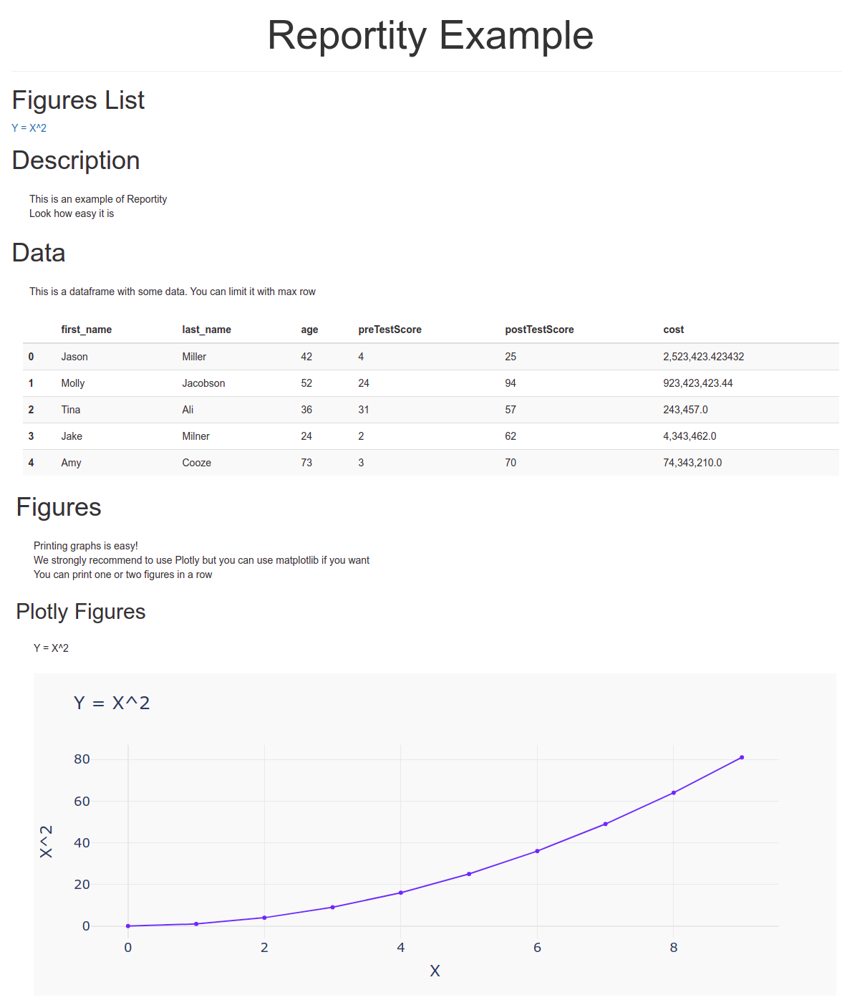

# REPORTITY

## Description

Reportity is an easy to use library for displaying figures/dataframes and text. Reportity generates an interactive html report on the fly and execute it at the end of the run.

## Example

For the full example code look at the examples folder

The following code display dataframe and figure -

```python
report = reportity.Reportity(
    title='Reportity Example',
)
report.print_header(
    text='Description',
    level=1,
)
report.print_paragraph(
    text='This is an example of Reportity'
)
report.print_header(
    text='Data',
    level=2,
)
report.print_paragraph(
    text='The data'
)
report.print_dataframe(
    dataframe=dataframe,
    max_rows=5,
)
report.print_header(
    text='Figures',
    level=2,
)
report.print_figure(
    figure=fig,
)
report.show()
```



## Installation

```bash
pip instal reportity
```

### possible Problems

1. If tinker is not installed -
    apt-get install python3-tk

## Limitations

1. Some complicated figures might not rendered to Javascript or will get messed up. In this case you can use the _print_figure_ method with the parameter image=True. This will show the figure as an image and not an interactive Javascript figure

```python
report.print_figure(
    figure=fig,
    image=True,
)
```

## Usage

Create reportity object with a title

```python
report = reportity.Reportity(
        title='Repority Title',
    )
```

Add header and give it a level

```python
report.print_header(
        text='Header name with level 1',
        level=1,
    )
```

Add paragraph

```python
report.print_paragraph(
    text='This is paragraph text'
)
```

Add dataframe, you can choose maximum rows to display

```python
report.print_dataframe(
    dataframe=dataframe,
    max_rows=5,
)
```

Add figure, If image=True than the figure will be an image and not interactive figure, use it when the figure is not displaying correctly

```python
report.print_figure(
    figure=fig,
    image=False,
)
report.print_2_figures(
    figure_left=fig_left,
    figure_right=fig_right,
)
```

Save report as html

```python
report.save_as_html(
    path='destination_folder/report.html',
)
```

## Sharing Reports

if you want to share the report with someone that dose not have plotly install in her computer you need to create the report with the following flag:

```python
report = reportity.Reportity(
    title='Reportity Example',
    include_plotly_js=True,
)
```

This will include some js needed for the plots to stay interactive. If you add it the report size will be a bit bigger so make sure you don't add it always
